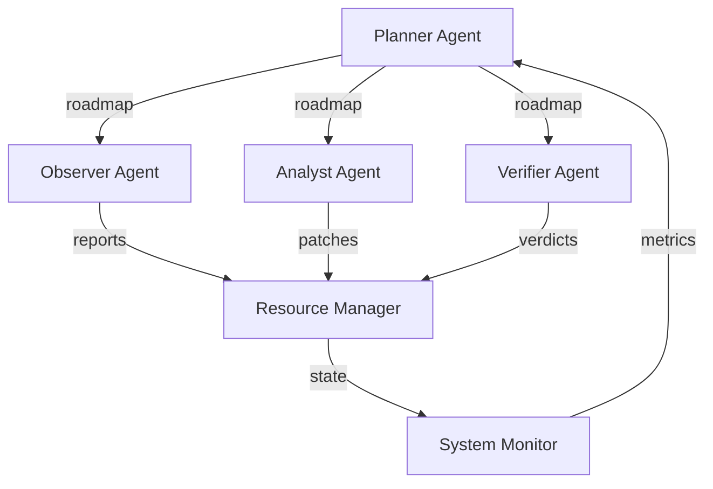
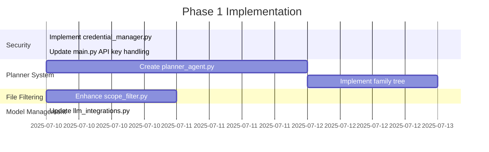

# FixWurx Deployment Roadmap

## Core Architecture

## LLM Model Selection
| Model | Use Case | Rationale |
|-------|----------|-----------|
| GPT-4-turbo | Primary analysis | Best cost/performance for code tasks |
| Claude 3 Sonnet | Fallback when GPT unavailable | Strong reasoning capabilities |
| Local LLM (e.g. CodeLlama) | Offline debugging | For sensitive environments |

## Agent Family Tree
1. **Planner Agent (Root)**
   - Generates starting points and execution paths
   - Maintains agent relationships
   - Handles error recovery paths
   
2. **Observer Agent (Child)**
   - File system monitoring
   - Bug reproduction
   
3. **Analyst Agent (Child)**
   - Patch generation
   - Code analysis

4. **Verifier Agent (Child)**
   - Patch validation
   - Test execution

## File Map
| File | Purpose | Status |
|------|---------|--------|
| `agent_coordinator.py` | Agent orchestration | REFACTOR (add planner integration) |
| `credential_manager.py` | Secure API key management | COMPLETE |
| `planner_agent.py` | Path generation | NEW |
| `scope_filter.py` | Source file detection | ENHANCE (add extension-based filtering) |
| `replay_buffer.py` | Fix/plan storage | ENHANCE (add compression) |
| `family_tree.json` | Agent relationships | NEW (in-memory storage) |
| `llm_integrations.py` | Model management | COMPLETE |
| `main.py` | Entry point | COMPLETE |
| `system_config.yaml` | Configuration | UPDATE (add model selection) |
| `patch_bundle.py` | Patch management | KEEP |
| `triangulation_engine.py` | Core engine | KEEP |
| `resource_manager.py` | Resource allocation | KEEP |

## Storage Strategy
1. **Fixes Storage**
   - Compressed diffs in `replay_buffer.py`
   - Metadata: Timestamp, bug ID, success status

2. **Plans Storage**
   - JSON snippets in memory (persisted to `family_tree.json` on exit)
   - Includes: Execution paths, dependencies, fallback strategies

3. **Error Logs**
   - Structured logging in `system_monitor.py`
   - Rotating buffer (last 100 errors)

## Implementation Phases

### Phase 1: Core Enhancements (Current Sprint)

### Phase 2: Collaboration & Storage (Next Sprint)
- Implement compressed replay buffers
- Add agent handoff protocols
- Create plan versioning system

### Phase 3: Optimization
- Introduce canary testing
- Add entropy-based scheduling
- Implement automatic rollback

## Validation Plan
1. Unit tests for all new components
2. Integration testing with sample bug datasets
3. Canary deployment to staging environment
4. Final verification with real-world codebases

## Critical Success Factors
1. 100% source file detection accuracy
2. Mean Time To Repair (MTTR) < 15min
3. Zero regressions in patched code
4. Planner coverage of 95% execution paths
