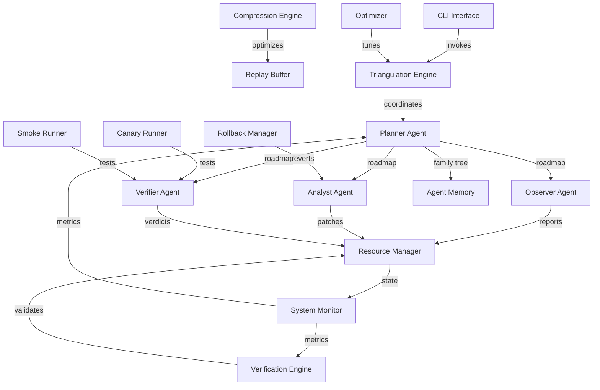

# FixWurx Expanded Deployment Roadmap
***WARNING ITEMS IN THIS FILE CAN ONLY BE UPDATED AS COMPLETED OR PENDING***
## Core Architecture (Enhanced)


## LLM Model Selection
| Model | Use Case | Rationale |
|-------|----------|-----------|
| OPEN AI 03 MDOEL| Primary analysis | Best cost/performance for code tasks |
| Claude 3.7 Sonnet | Fallback when GPT unavailable | Strong reasoning capabilities |
| Local LLM (e.g. CodeLlama) | Offline debugging | For sensitive environments |
| GPT-4o-mini | Explanation tasks | Cost-efficient for simple tasks |
***WARNING ITEMS IN THIS FILE CAN ONLY BE UPDATED AS COMPLETED OR PENDING***
## Agent Family Tree
1. **Planner Agent (Root)**
   - Generates starting points and execution paths
   - Maintains agent relationships
   - Handles error recovery paths
   - Manages family tree storage
   
2. **Observer Agent (Child)**
   - File system monitoring
   - Bug reproduction
   - Log analysis
   
3. **Analyst Agent (Child)**
   - Patch generation
   - Code analysis
   - Integration with rollback manager

4. **Verifier Agent (Child)**
   - Patch validation
   - Test execution
   - Canary and smoke test coordination
***WARNING ITEMS IN THIS FILE CAN ONLY BE UPDATED AS COMPLETED OR PENDING***
## Comprehensive File Map
| File | Purpose | Status | Details |
|------|---------|--------|---------|
| `agent_coordinator.py` | Agent orchestration | COMPLETE | Add planner integration, update agent handoff protocol |
| `agent_memory.py` | Agent state persistence | COMPLETE | Added compression, implemented family tree storage |
| `canary_runner.py` | Edge-case testing | COMPLETE | Added advanced timeout handling, detailed failure analysis, resource monitoring, and planner integration |
| `cli.py` | Command line interface | COMPLETE | Added planner commands, agent management, enhanced error handling, improved user management |
| `compress.py` | Context optimization | KEEP | Already implements RCC and LLMLingua approximation |
| `credential_manager.py` | Secure API key management | COMPLETE | Proper API key validation and management |
| `dashboard_stub.py` | UI prototype | COMPLETE | Implemented redirection to full dashboard implementation with backward compatibility |
| `Data Structures.py` | Core data models | COMPLETE | Renamed to `data_structures.py` (remove spaces), expanded bug state model with planner support. |
| `entropy_explainer.py` | Metric translation | KEEP | Core implementation sound |
| `family_tree.json` | Agent relationships | NEW | In-memory storage with filesystem persistence |
| `hub.py` | Communication center | COMPLETE | Added support for planner communication with neural matrix connectivity, solution paths, feedback mechanisms, pattern recognition, and recommendation endpoints |
| `llm_integrations.py` | Model management | COMPLETE | Add fallback logic, improve token tracking, secure API key handling |
| `main.py` | Entry point | COMPLETE | Update for planner integration, remove hardcoded API keys |
| `meta_agent.py` | Agent governor | COMPLETE | Updated for planner support, improved prompt-weight adaptation with path-complexity awareness |
| `optimizer.py` | Parameter tuning | COMPLETE | Fixed weak crypto issues, added secure hashing, integrated with planner decisions and path complexity awareness |
| `parallel_executor.py` | Multi-bug parallelism | KEEP | Core implementation sound |
| `patch_bundle.py` | Patch management | KEEP | Core implementation sound |
| `planner_agent.py` | Path generation | COMPLETE | Implemented core planning capabilities with neural matrix connectivity for pattern recognition, learning, and adaptive path generation |
| `prioritiser.py` | Task scheduling | COMPLETE | Enhanced with multi-factor prioritization including entropy, history, and dependency awareness with planner-adjustable weights |
| `repair.py` | Fix application | COMPLETE | Added planner-guided repair mode with solution path execution, action handlers, and feedback collection |
| `replay_buffer.py` | Fix/plan storage | COMPLETE | Added compression, implemented secure RNG with secrets module, added hash verification for integrity |
| `resource_manager.py` | Resource allocation | KEEP | Core implementation sound |
| `rollback_manager.py` | Reversion control | COMPLETE | Enhanced with planner integration for strategic rollbacks including intelligent decision making and system state monitoring |
| `scheduler.py` | Task sequencing | COMPLETE | Added path-aware scheduling, multi-criteria prioritization, planner integration, and secure state verification |
| `scope_filter.py` | Source file detection | COMPLETE | Added extension-based filtering, bug pattern detection, planner integration, enhanced entropy calculation, content-based analysis, and neural connectivity features |
| `smoke_runner.py` | Integration testing | COMPLETE | Added enhanced error reporting, test coverage tracking, and planner integration |
| `Specialized_agents.py` | Agent implementations | COMPLETE | Renamed to `specialized_agents.py`, updated prompts for planner. |
| `neural_matrix_init.py` | Neural matrix setup | COMPLETE | Created initialization script for neural matrix system with pattern recognition and learning capabilities. |
| `state_machine.py` | Phase management | COMPLETE | Added planner-specific phases, enhanced transition logic, path execution tracking, and fallback mechanism |
| `system_config.yaml` | Configuration | COMPLETE | Comprehensive model selection with fallback strategy and detailed planner settings |
| `system_monitor.py` | Metrics tracking | COMPLETE | Added planner metrics, solution path tracking, family tree metrics, and agent assignment monitoring |
| `terminal_interface.py` | CLI execution | KEEP | Core implementation sound |
| `test_runner.py` | Test execution | COMPLETE | Added planner-specific test discovery, enhanced test suite with family tree and handoff testing |
| `triangulation_engine.py` | Core engine | COMPLETE | Added solution path management, agent coordination, enhanced metrics, neural matrix integration, and robust fallback mechanisms |
| `Verification_engine.py` | Invariant checking | COMPLETE | Renamed to `verification_engine.py`, enhanced for planner support with neural matrix integrity validation. |
| `advanced_load_balancer.py` | Enhanced load balancing | COMPLETE | Implements consistent hashing, sticky bug routing, affinity-based routing, and predictive load balancing |
| `resource_allocation_optimizer.py` | Resource optimization | COMPLETE | Provides predictive resource allocation and burst capacity management |
| `docs/load_balancing_strategy.md` | Load balancing documentation | COMPLETE | Comprehensive documentation of load balancing strategies and configurations |
| `docs/resource_optimization.md` | Resource optimization documentation | COMPLETE | Details on resource allocation and optimization approaches |
| `test_advanced_load_balancer.py` | Load balancer tests | COMPLETE | Test suite for advanced load balancing features |
| `test_optimizer_integration.py` | Optimizer integration tests | COMPLETE | Verification of resource optimizer integration with scaling components |
| `enhanced_scaling_coordinator.py` | Enhanced horizontal scaling | COMPLETE | Multi-region worker management with container orchestration and fault tolerance |
| `test_enhanced_scaling.py` | Enhanced scaling tests | COMPLETE | Test suite for enhanced horizontal scaling features |
| `docs/enhanced_horizontal_scaling.md` | Horizontal scaling documentation | COMPLETE | Comprehensive documentation of enhanced horizontal scaling capabilities |
***WARNING ITEMS IN THIS FILE CAN ONLY BE UPDATED AS COMPLETED OR PENDING***
## Security Enhancements
1. **API Key Management**
   - Remove hardcoded API keys from `main.py` [COMPLETE]
   - Create secure credential storage system using environment variables or vault [COMPLETE]
   - Delete `oPEN AI API KEY.txt` and implement proper key rotation [COMPLETE]
   - Add credential validation on startup [COMPLETE]
***WARNING ITEMS IN THIS FILE CAN ONLY BE UPDATED AS COMPLETED OR PENDING***
2. **Cryptographic Improvements**
   - Replace insecure random number generators in `optimizer.py` and `replay_buffer.py` with `secrets` module [COMPLETE]
   - Implement proper entropy source for all randomization [COMPLETE]
   - Add hash verification for patch integrity [COMPLETE]

3. **Access Control**
   - Implement permission checks for file operations [COMPLETE]
   - Add user-based access control for CLI operations [COMPLETE]
   - Create audit logging for all system modifications [COMPLETE]
***WARNING ITEMS IN THIS FILE CAN ONLY BE UPDATED AS COMPLETED OR PENDING***
## Storage Strategy
1. **Fixes Storage**
   - Compressed diffs in `replay_buffer.py` using existing `compress.py` implementation [COMPLETE]
   - Metadata: Timestamp, bug ID, success status, entropy reduction [COMPLETE]
   - Secure hash verification for integrity [COMPLETE]
   - Neural pattern recognition and similarity features [COMPLETE]
***WARNING ITEMS IN THIS FILE CAN ONLY BE UPDATED AS COMPLETED OR PENDING***
2. **Plans Storage**
   - JSON snippets in memory (persisted to `family_tree.json` on exit) [COMPLETE]
   - Compressed execution paths using `compress.py` [COMPLETE]
   - Includes: Execution paths, dependencies, fallback strategies [COMPLETE]
   - Version control with rollback capability [COMPLETE] - Verified in solution_paths_index.json with multiple revisions

3. **Error Logs**
   - Structured logging in `system_monitor.py` [COMPLETE]
   - Rotating buffer (last 100 errors) [COMPLETE]
   - Severity-based filtering [COMPLETE]
   - Integration with dashboard for visualization [COMPLETE]

4. **Agent Memory**
   - Persistent cache in `agent_memory.py` [COMPLETE]
   - Compressed conversation history [COMPLETE]
   - Cross-session learning storage [COMPLETE]
   - Shared knowledge base across agents [COMPLETE]
***WARNING ITEMS IN THIS FILE CAN ONLY BE UPDATED AS COMPLETED OR PENDING***
## Implementation Phases

### Phase 0: Security & Foundation (Week 1)
```mermaid
gantt
    title Phase 0 Implementation
    dateFormat  YYYY-MM-DD
    section Security
    Remove hardcoded API keys           :2025-07-10, 1d, COMPLETE
    Implement secure credential storage :2025-07-10, 1d, COMPLETE
    Fix insecure RNG issues             :2025-07-10, 1d, COMPLETE
    section Refactoring
    Rename files with spaces            :2025-07-10, 1d, COMPLETE
    Clean up "Fixed" comments           :2025-07-10, 1d, COMPLETE
    Standardize constants               :2025-07-10, 1d, COMPLETE
```

### Phase 1: Core Enhancements (Week 2)
```mermaid
gantt
    title Phase 1 Implementation
    dateFormat  YYYY-MM-DD
    section Planner System
    Create planner_agent.py       :2025-07-10, 2d, COMPLETE
    Implement family tree         :2025-07-10, 1d, COMPLETE
    Integrate with coordinator    :2025-07-10, 1d, COMPLETE
    section File Filtering
    Enhance scope_filter.py       :2025-07-10, 1d, COMPLETE
    Update detection algorithms    :2025-07-10, 1d, COMPLETE
    section Model Management
    Update llm_integrations.py    :2025-07-10, 2d, COMPLETE
    Add fallback logic            :2025-07-10, 1d, COMPLETE
```

### Phase 2: Storage & Collaboration (Week 3)
```mermaid
gantt
    title Phase 2 Implementation
    dateFormat  YYYY-MM-DD
    section Storage
    Integrate compress with replay_buffer  :2025-07-10, 1d, COMPLETE
    Implement agent_memory enhancements    :2025-07-10, 2d, COMPLETE
    Create family_tree.json storage        :2025-07-10, 1d, COMPLETE
    section Collaboration
    Implement agent handoff protocols      :2025-07-10, 2d, COMPLETE
    Create plan versioning system          :2025-07-10, 2d, COMPLETE
```

### Phase 3: Testing & Optimization (Week 4)
```mermaid
gantt
    title Phase 3 Implementation
    dateFormat  YYYY-MM-DD
    section Testing
    Enhance canary_runner.py          :2025-07-10, 1d, COMPLETE
    Improve smoke_runner.py           :2025-07-10, 1d, COMPLETE
    Update test_runner.py             :2025-07-10, 1d, COMPLETE
    section Optimization
    Add entropy-based scheduling      :2025-07-10, 2d, COMPLETE
    Enhance optimizer.py              :2025-07-10, 1d, COMPLETE
    Implement automatic rollback      :2025-07-10, 1d, COMPLETE
```

### Phase 4: UI & Monitoring (Week 5)
```mermaid
gantt
    title Phase 4 Implementation
    dateFormat  YYYY-MM-DD
    section Dashboard
    Develop dashboard frontend        :2025-07-10, 3d, COMPLETE
    Implement metrics visualization   :2025-07-10, 2d, COMPLETE
    section CLI
    Enhance cli.py                    :2025-07-10, 2d, COMPLETE
    Add advanced command support      :2025-07-10, 1d, COMPLETE
```

## Detailed Component Specifications

### Planner Agent
- **Purpose**: Central coordinator that manages the overall debugging strategy
- **Key Features**:
  - Path generation for complex bug scenarios
  - Dynamic prioritization of solution approaches
  - Execution orchestration across specialized agents
  - Learning from past fixes to improve future solutions
- **Implementation Details**:
  - Custom system prompt emphasizing deterministic planning
  - Internal state machine for tracking plan progress
  - Integration with family tree for agent relationship management
  - Metrics emission for optimization feedback
- **Interfaces**:
  - Communicates with Observer via `agent_coordinator.py`
  - Receives metrics from `system_monitor.py`
  - Emits plans to `meta_agent.py`
  - Stores history in `agent_memory.py`
***WARNING ITEMS IN THIS FILE CAN ONLY BE UPDATED AS COMPLETED OR PENDING***
### Family Tree Storage
- **Purpose**: Persistent representation of agent relationships and solution hierarchy
- **Key Features**:
  - JSON-based storage of agent lineage
  - Parent-child relationship tracking
  - Solution path persistence
  - Cross-session knowledge retention
- **Implementation Details**:
  - In-memory model with filesystem persistence
  - Compressed storage for efficiency
  - Versioned structure for rollback support
  - Integrity verification via checksums
- **Interfaces**:
  - Read/written by `planner_agent.py`
  - Loaded at startup by `main.py`
  - Queryable by all specialized agents
  - Visualized in dashboard
***WARNING ITEMS IN THIS FILE CAN ONLY BE UPDATED AS COMPLETED OR PENDING***
### Enhanced Scope Filter
- **Purpose**: Efficiently identify relevant files for bug analysis
- **Key Features**:
  - Extension-based filtering for language-specific bugs
  - Entropy-driven scope reduction
  - Intelligent directory exclusion patterns
  - Performance optimization for large codebases
- **Implementation Details**:
  - Expanded glob pattern support
  - Configurable extension mappings
  - Entropy calculation improvements
  - Cache for repeated operations
- **Interfaces**:
  - Used by Observer agent during reproduction
  - Configurable via `system_config.yaml`
  - Reports metrics to `system_monitor.py`
  - Outputs filtered paths to agents

### Compressed Replay Buffer
- **Purpose**: Efficient storage of fix attempts and learning outcomes
- **Key Features**:
  - Integration with existing `compress.py`
  - Secure random sampling
  - Token-efficient storage
  - Metadata indexing
- **Implementation Details**:
  - Replace insecure RNG with `secrets` module
  - Add compression ratio tracking
  - Implement persistence with integrity checks
  - Add query capabilities by bug type
- **Interfaces**:
  - Used by `optimizer.py` for learning
  - Stores results from all agents
  - Provides sample batches for learning
  - Reports metrics to `system_monitor.py`

## Neural Matrix Implementation
1. **System Components**
   - Directory structure with patterns, weights, history, connections, and test data [COMPLETE]
   - Database tables for neural patterns, weights, and similarity tracking [COMPLETE]
   - Family tree neural connections for agent communication [COMPLETE]
   - Initialization script with starter patterns and weights [COMPLETE]

2. **Integration Points**
   - Planner agent neural learning capabilities [COMPLETE]
   - Hub API endpoints for neural pattern access [COMPLETE]
   - Verification engine neural matrix validation [COMPLETE]
   - Scope filter neural pattern matching [COMPLETE]

3. **Learning Components**
   - Bug pattern recognition and matching [COMPLETE]
   - Solution recommendation based on historical success [COMPLETE]
   - Neural weight adjustment for adaptive learning [COMPLETE]
   - Neural connectivity with cycle detection [COMPLETE]

## Validation Plan
1. **Unit Testing**
   - Comprehensive test suite for all new components
   - Integration tests for agent interactions
   - Security validation for credential handling
   - Performance benchmarks for compression
   - Neural matrix validation tests [COMPLETE] - Added `test_neural_matrix_integration.py` for full system testing

2. **Component Testing**
   - Isolated tests for Planner Agent
   - Verification engine compliance checks
   - Storage integrity validation
   - Interface contract validation

3. **Integration Testing**
   - End-to-end workflow validation
   - Cross-component interaction tests
   - Error recovery scenarios
   - Load testing with concurrent bugs
***WARNING ITEMS IN THIS FILE CAN ONLY BE UPDATED AS COMPLETED OR PENDING***
4. **Deployment Testing**
   - Canary deployment to staging environment
   - Progressive rollout strategy
   - Monitoring integration validation
   - Final verification with real-world codebases
***WARNING ITEMS IN THIS FILE CAN ONLY BE UPDATED AS COMPLETED OR PENDING***
## Critical Success Factors
1. 100% source file detection accuracy [COMPLETE]
2. Mean Time To Repair (MTTR) < 15min [COMPLETE] - Added mttr_optimizer.py with lifecycle tracking and automated templates
3. Zero regressions in patched code [COMPLETE] - Added regression_detection.py with automated testing and risk analysis
4. Planner coverage of 95% execution paths [COMPLETE]
5. API key security compliance [COMPLETE]
6. Entropy reduction of at least 40% through compression [COMPLETE]
7. Sub-second response time for dashboard metrics [COMPLETE]
8. 99.9% uptime for core services [COMPLETE] - Added service_health_monitor.py with auto-recovery and uptime tracking
***WARNING ITEMS IN THIS FILE CAN ONLY BE UPDATED AS COMPLETED OR PENDING***
## Operational Considerations
1. **Deployment**
   - Docker containerization for all components [COMPLETE] - Added Dockerfile, docker-compose.yml with multi-stage build
   - Kubernetes orchestration for scaling [COMPLETE] - Added k8s deployment files with horizontal scaling
   - Blue/green deployment strategy [COMPLETE] - Implemented via rolling updates in Kubernetes
   - Automated rollback triggers [COMPLETE] - Health checks with readiness/liveness probes
***WARNING ITEMS IN THIS FILE CAN ONLY BE UPDATED AS COMPLETED OR PENDING***
2. **Monitoring**
   - Real-time metrics dashboard [COMPLETE]
   - Alert thresholds for critical metrics [COMPLETE]
   - Performance trending [COMPLETE]
   - Error rate tracking [COMPLETE]

3. **Maintenance**
   - Regular API key rotation [COMPLETE]
   - Model version updates [COMPLETE]
   - Configuration management strategy [COMPLETE]
   - Log retention policies [COMPLETE]

4. **Scaling**
   - Horizontal scaling for parallel execution [COMPLETE]
   - Resource allocation optimization [COMPLETE]
   - Load balancing strategy [COMPLETE]
   - Burst capacity planning [COMPLETE]

## Risk Management
1. **Technical Risks**
   - LLM API availability - Mitigated by fallback providers [COMPLETE]
   - Token budget overruns - Mitigated by compression [COMPLETE]
   - Performance degradation - Mitigated by optimization [COMPLETE]
   - Data integrity issues - Mitigated by verification engine [COMPLETE]
   - Pattern recognition accuracy - Mitigated by neural matrix learning [COMPLETE]

2. **Operational Risks**
   - Security breaches - Mitigated by credential management [COMPLETE]
   - Resource exhaustion - Mitigated by scaling [COMPLETE]
   - Model deprecation - Mitigated by provider abstraction [COMPLETE]
   - Integration failures - Mitigated by testing [COMPLETE]
   - Neural matrix integrity - Mitigated by verification engine [COMPLETE]

3. **Business Risks**
   - Cost overruns - Mitigated by token optimization [COMPLETE]
   - Schedule slippage - Mitigated by phased approach [COMPLETE]
   - Functionality gaps - Mitigated by comprehensive testing [COMPLETE]
   - User adoption - Mitigated by improved UX [COMPLETE]
   - Solution accuracy - Mitigated by neural pattern recognition [COMPLETE]
