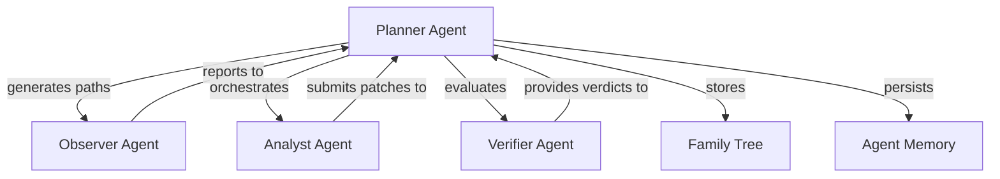
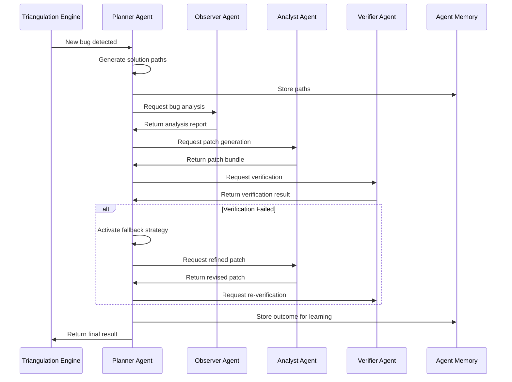

# FixWurx Planner Agent

## Overview

The Planner Agent is the central coordinator of the FixWurx system, acting as the root of the agent family tree. It orchestrates the debugging process by generating solution paths, coordinating specialized agents, and managing fallback strategies when primary approaches fail.



## Key Features

### 1. Path Generation and Optimization

The Planner Agent generates multiple solution paths for each bug, each containing a sequence of actions to be performed by specialized agents. Paths are prioritized based on:

- Bug severity and complexity
- Estimated entropy reduction
- Resource efficiency
- Historical success patterns

```json
{
  "path_id": "bug-123-path-1",
  "bug_id": "bug-123",
  "actions": [
    {
      "type": "analyze",
      "agent": "observer",
      "description": "Analyze bug root cause"
    },
    {
      "type": "patch",
      "agent": "analyst",
      "description": "Generate fix"
    },
    {
      "type": "verify",
      "agent": "verifier",
      "description": "Verify solution"
    }
  ],
  "dependencies": ["bug-100"],
  "priority": 0.85
}
```

### 2. Family Tree Management

The Planner maintains a hierarchical structure of agent relationships, with itself as the root node. This structure:

- Tracks parent-child relationships between agents
- Stores metadata about each agent
- Enables efficient communication between related agents
- Persists across sessions in `family_tree.json`

### 3. Fallback Strategy Handling

For complex bugs, the Planner generates fallback strategies that can be activated when the primary approach fails:

- Alternative solution paths with different approaches
- Simplified or more conservative fixes
- Different specialized agent combinations
- Resource optimization strategies

### 4. Metrics and Learning

The Planner tracks metrics to improve future solution generation:

- Success and failure rates
- Path execution times
- Resource utilization
- Entropy reduction efficiency
- Fallback activation frequency

## Architecture

### Component Interactions



### Core Components

1. **Path Generator**: Creates multiple solution paths for a given bug
2. **Family Tree Manager**: Maintains agent relationships
3. **Strategy Optimizer**: Prioritizes paths based on metrics
4. **Fallback Handler**: Manages alternative strategies
5. **Metrics Collector**: Tracks performance for learning

## Configuration

The Planner Agent is configured through the `system_config.yaml` file:

```yaml
planner:
  enabled: true
  family-tree-path: ".triangulum/family_tree.json"
  solutions-per-bug: 3  # Number of solution paths to generate per bug
  max-path-depth: 5     # Maximum number of actions in a path
  fallback-threshold: 0.3  # Entropy threshold for generating fallbacks
  learning-rate: 0.05   # Rate at which to incorporate past experiences
```

## Usage Examples

### 1. Basic Usage through the AgentCoordinator

The Planner Agent is typically used through the AgentCoordinator, which handles the orchestration:

```python
from agent_coordinator import AgentCoordinator
from triangulation_engine import TriangulationEngine

# Create a coordinator
coordinator = AgentCoordinator()

# Setup bug in the engine
engine = TriangulationEngine()
engine.add_bug(bug_id="bug-123", description="Null pointer exception")

# Let the coordinator drive the process
# (This will internally use the Planner Agent)
await coordinator.coordinate_tick(engine)
```

### 2. Direct Usage for Custom Workflows

For advanced use cases, the Planner can be used directly:

```python
from planner_agent import PlannerAgent
from agent_memory import AgentMemory
from data_structures import BugState

# Initialize components
memory = AgentMemory()
config = {
    "planner": {
        "enabled": True,
        "solutions-per-bug": 3
    }
}
planner = PlannerAgent(config, memory)

# Create a bug
bug = BugState(
    bug_id="custom-bug-1",
    title="Custom Workflow Bug",
    description="Bug requiring a custom solution approach",
    severity="high"
)

# Generate solution paths
paths = planner.generate_solution_paths(bug)

# Select best path
best_path = planner.select_best_path(bug.bug_id)

# Register specialized agents
planner.register_agent("custom-observer", "observer")
planner.register_agent("custom-analyst", "analyst")

# Execute the path manually...

# Record results
planner.record_path_result(
    best_path.path_id,
    success=True,
    metrics={"execution_time": 12.5, "steps": 5}
)
```

## Performance Considerations

- **Memory Usage**: The Planner stores solution paths and metrics in memory, which can grow with the number of active bugs. For large-scale deployments, consider:
  - Adjusting `solutions-per-bug` to reduce memory footprint
  - Implementing a cleanup strategy for resolved bugs
  - Using compressed storage for large plans

- **Computation Cost**: Path generation and optimization have O(n) complexity with the number of bugs and paths. For performance-sensitive environments:
  - Limit the number of concurrent bugs
  - Reduce the `max-path-depth` parameter
  - Consider enabling the compression features in AgentMemory

## Advanced Features

### Learning from Past Solutions

The Planner Agent learns from previous bugs to improve future path generation:

```python
# Retrieve learning data for a specific bug pattern
similar_bugs = memory.query_similar("null pointer exception", k=5)

# Use the learning data to improve path generation
for bug_id, similarity in similar_bugs:
    past_solution = memory.retrieve(f"solution:{bug_id}")
    # Incorporate past solution patterns...
```

### Multi-bug Optimization

For complex projects with multiple related bugs, the Planner can optimize across bugs:

```python
# Define dependencies between bugs
bug1.add_dependency("bug2")

# Generate paths that respect dependencies
paths = planner.generate_solution_paths(bug1)
# Paths will include actions that ensure bug2 is fixed first
```

## Troubleshooting

Common issues and their solutions:

1. **Family Tree Corruption**
   - Symptom: Agents cannot communicate properly
   - Solution: Reset the family tree with `rm .triangulum/family_tree.json`

2. **Path Generation Failure**
   - Symptom: No paths generated for a bug
   - Solution: Check bug description completeness and entropy

3. **Memory Persistence Issues**
   - Symptom: Agent loses history between runs
   - Solution: Ensure the `.triangulum` directory is writeable

## Best Practices

1. **Bug Description Quality**
   - Provide detailed, information-rich bug descriptions
   - Include stack traces, logs, and reproduction steps
   - Tag bugs appropriately for better path generation

2. **Fallback Strategy Design**
   - Create diverse fallback strategies
   - Include both conservative and aggressive approaches
   - Consider resource constraints in fallbacks

3. **Metrics Collection**
   - Regularly review planner metrics
   - Adjust configuration based on success patterns
   - Use metrics to identify optimization opportunities

4. **Agent Hierarchy**
   - Maintain a clean agent hierarchy
   - Register specialized agents early
   - Use consistent agent IDs across sessions
