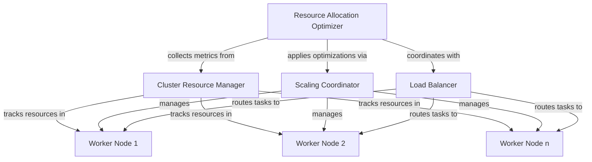

# Resource Allocation Optimization

## Overview

The Resource Allocation Optimization system is a key component of FixWurx's horizontal scaling capability. It provides intelligent resource management across worker nodes by:

1. Dynamically allocating resources based on real-time load patterns
2. Predicting future resource requirements using historical data
3. Managing burst capacity for temporary load spikes
4. Optimizing resource distribution for maximum efficiency
5. Integrating with the scaling coordinator and load balancer

This document describes the design, implementation, and usage of the resource allocation optimization system.

## Architecture

The resource allocation optimization system consists of the following components:



### Components

1. **Resource Allocation Optimizer**: The central component that analyzes resource usage patterns, creates optimization plans, and manages burst capacity.

2. **Cluster Resource Manager**: Tracks resource allocation across all worker nodes in the cluster.

3. **Scaling Coordinator**: Manages worker nodes, including scaling up and down based on optimizer recommendations.

4. **Load Balancer**: Distributes tasks across worker nodes based on capacity and health.

5. **Worker Nodes**: Individual processing units that execute bug-fixing tasks.

## Implementation Details

### Resource Usage Tracking

The optimizer collects resource usage snapshots at regular intervals. Each snapshot includes:

- Total agent count across the cluster
- Used agent count
- Active bug count
- Worker-specific usage metrics

These snapshots are stored in a historical record that forms the basis for resource predictions and optimization decisions.

### Prediction Algorithm

The system uses a simple linear regression model to predict future resource requirements:

1. Recent snapshots are analyzed to detect usage trends
2. The trend is extrapolated to predict near-future usage
3. Prediction confidence increases with more historical data

When high resource usage is predicted (>90% utilization), the system enters burst mode to proactively allocate additional resources.

### Optimization Plans

Optimization plans are created based on historical usage patterns and predictions:

1. For each worker, an ideal agent count is calculated
2. Priority is assigned based on the difference between current and ideal counts
3. Plans are sorted by priority and applied sequentially
4. Changes are coordinated with the scaling coordinator

### Burst Capacity Management

Burst capacity provides temporary additional resources during peak loads:

1. System enters burst mode when high utilization is predicted or detected
2. Resource allocations are multiplied by the burst capacity factor (default: 1.2)
3. Burst mode automatically exits after the peak subsides
4. Maximum burst duration prevents resource wastage

## Usage

### Configuration

The resource allocation optimizer can be configured with the following parameters:

| Parameter | Description | Default |
|-----------|-------------|---------|
| optimization_interval_sec | Interval between optimization runs | 30 seconds |
| usage_history_size | Number of usage snapshots to retain | 60 snapshots |
| burst_capacity_factor | Multiplier for burst mode resources | 1.2 (20% extra) |

### Integration

To integrate the resource allocation optimizer into your FixWurx deployment:

```python
from resource_allocation_optimizer import ResourceAllocationOptimizer

# Create and configure the optimizer
optimizer = ResourceAllocationOptimizer(
    cluster_resource_manager=cluster_manager,
    scaling_coordinator=scaling_coordinator,
    optimization_interval_sec=30,
    usage_history_size=60,
    burst_capacity_factor=1.2
)

# Start the optimization process
optimizer.start()
```

### Monitoring

The optimizer provides metrics to monitor its operation:

```python
# Get current optimization metrics
metrics = optimizer.get_optimization_metrics()

print(f"Current usage ratio: {metrics['current_usage_ratio']:.2f}")
print(f"In burst mode: {metrics['in_burst_mode']}")
print(f"Pending plans: {metrics['pending_plans']}")
```

### Manual Control

In addition to automatic operation, the optimizer provides methods for manual control:

```python
# Manually force burst mode for a specific duration
optimizer.force_burst_mode(duration_sec=300)  # 5 minutes

# Adjust burst capacity factor
optimizer.adjust_burst_factor(1.5)  # 50% extra capacity
```

## Testing

The resource allocation optimizer includes a comprehensive test suite that verifies:

1. Resource usage collection and tracking
2. Prediction accuracy
3. Optimization plan creation and application
4. Burst capacity management
5. Integration with other system components

To run the tests:

```bash
python test_resource_allocation.py
```

## Performance Considerations

- **Memory usage**: The default configuration stores 60 snapshots, requiring minimal memory.
- **CPU usage**: The prediction algorithm is lightweight and runs infrequently.
- **Network impact**: The optimizer itself generates no network traffic, but may trigger scaling operations.

## Best Practices

1. **Tuning the burst factor**: Start with a conservative value (1.1-1.2) and adjust based on your workload patterns.

2. **Optimization interval**: Shorter intervals (10-30s) react quickly to changes but may cause thrashing; longer intervals (60-300s) are more stable but less responsive.

3. **Usage history size**: Larger history (100+) provides better prediction accuracy but requires more memory and may be slower to adapt to new patterns.

4. **Integration with monitoring**: Connect the optimizer metrics to your monitoring system for visibility into resource optimization decisions.

## Future Enhancements

1. **Advanced prediction models**: Replace linear regression with more sophisticated models (ARIMA, machine learning).

2. **Cost-aware optimization**: Consider resource costs when making allocation decisions.

3. **Multi-region support**: Optimize resources across multiple geographical regions.

4. **Auto-tuning parameters**: Automatically adjust burst factor and other parameters based on workload patterns.

5. **Anomaly detection**: Identify and respond to abnormal resource usage patterns.
