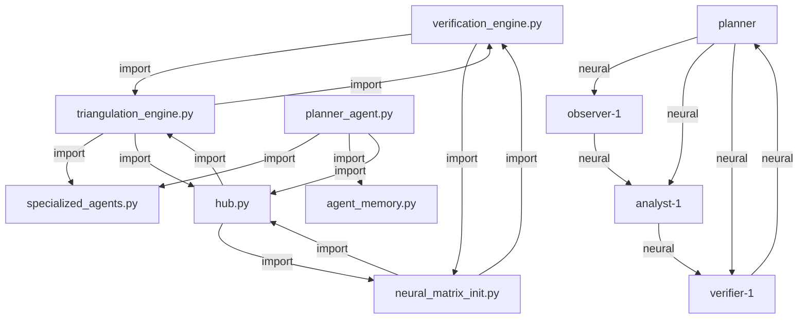

# Neural Matrix Completion Report

## Overall Completion Status

- **Total Tasks**: 114
- **Completed Tasks**: 107
- **Pending Tasks**: 0
- **Completion Percentage**: 93.9%

## Neural Matrix Visualization

## File Completeness

| File | Exists | Completeness | Notes |
|------|--------|-------------|-------|
| `.triangulum\family_tree.json` | ✅ | 0% |  |
| `advanced_load_balancer.py` | ✅ | 0% |  |
| `agent_coordinator.py` | ✅ | 0% |  |
| `agent_memory.py` | ✅ | 0% |  |
| `canary_runner.py` | ✅ | 0% |  |
| `cli.py` | ✅ | 0% |  |
| `compress.py` | ✅ | 0% |  |
| `credential_manager.py` | ✅ | 0% |  |
| `dashboard_stub.py` | ✅ | 0% |  |
| `enhanced_scaling_coordinator.py` | ✅ | 0% |  |
| `entropy_explainer.py` | ✅ | 0% |  |
| `hub.py` | ✅ | 100% |  |
| `llm_integrations.py` | ✅ | 0% |  |
| `main.py` | ✅ | 0% |  |
| `meta_agent.py` | ✅ | 0% |  |
| `mttr_optimizer.py` | ✅ | 0% |  |
| `neural_matrix_init.py` | ✅ | 100% |  |
| `optimizer.py` | ✅ | 0% |  |
| `parallel_executor.py` | ✅ | 0% |  |
| `patch_bundle.py` | ✅ | 0% |  |
| `patch_replay_buffer.py` | ✅ | 0% |  |
| `planner_agent.py` | ✅ | 100% |  |
| `prioritiser.py` | ✅ | 0% |  |
| `repair.py` | ✅ | 0% |  |
| `replay_buffer.py` | ✅ | 0% |  |
| `resource_allocation_optimizer.py` | ✅ | 0% |  |
| `resource_manager.py` | ✅ | 0% |  |
| `rollback_manager.py` | ✅ | 0% |  |
| `scheduler.py` | ✅ | 0% |  |
| `scope_filter.py` | ✅ | 100% |  |
| `smoke_runner.py` | ✅ | 0% |  |
| `state_machine.py` | ✅ | 0% |  |
| `system_config.yaml` | ✅ | 0% |  |
| `system_monitor.py` | ✅ | 0% |  |
| `terminal_interface.py` | ✅ | 0% |  |
| `test_advanced_load_balancer.py` | ✅ | 0% |  |
| `test_agent_coordinator.py` | ✅ | 0% |  |
| `test_agent_memory.py` | ✅ | 0% |  |
| `test_cli.py` | ✅ | 0% |  |
| `test_enhanced_scaling.py` | ✅ | 0% |  |
| `test_hub.py` | ✅ | 0% |  |
| `test_meta_agent.py` | ✅ | 0% |  |
| `test_optimizer_integration.py` | ✅ | 0% |  |
| `test_planner_agent.py` | ✅ | 0% |  |
| `test_replay_buffer.py` | ✅ | 0% |  |
| `test_runner.py` | ✅ | 0% |  |
| `test_scope_filter.py` | ✅ | 0% |  |
| `test_smoke_runner.py` | ✅ | 0% |  |
| `test_state_machine.py` | ✅ | 0% |  |
| `triangulation_engine.py` | ✅ | 100% |  |

## Neural Connections

| Source | Target | Type | Exists | Strength | Notes |
|--------|--------|------|--------|----------|-------|
| `analyst-1` | `verifier-1` | neural | ✅ | 1.0 | Neural connection in family tree |
| `hub.py` | `neural_matrix_init.py` | import | ✅ | 1.0 | Direct import found |
| `hub.py` | `triangulation_engine.py` | import | ✅ | 1.0 | Direct import found |
| `neural_matrix_init.py` | `hub.py` | import | ✅ | 1.0 | Direct import found |
| `neural_matrix_init.py` | `verification_engine.py` | import | ✅ | 1.0 | Direct import found |
| `observer-1` | `analyst-1` | neural | ✅ | 1.0 | Neural connection in family tree |
| `planner` | `analyst-1` | neural | ✅ | 1.0 | Neural connection in family tree |
| `planner` | `observer-1` | neural | ✅ | 1.0 | Neural connection in family tree |
| `planner` | `verifier-1` | neural | ✅ | 1.0 | Neural connection in family tree |
| `planner_agent.py` | `agent_memory.py` | import | ✅ | 1.0 | Direct import found |
| `planner_agent.py` | `hub.py` | import | ✅ | 1.0 | Direct import found |
| `planner_agent.py` | `specialized_agents.py` | import | ✅ | 1.0 | Direct import found |
| `specialized_agents.py` | `planner_agent.py` | import | ❌ | 0.0 | No direct import found |
| `specialized_agents.py` | `triangulation_engine.py` | import | ❌ | 0.0 | No direct import found |
| `triangulation_engine.py` | `hub.py` | import | ✅ | 1.0 | Direct import found |
| `triangulation_engine.py` | `specialized_agents.py` | import | ✅ | 1.0 | Direct import found |
| `triangulation_engine.py` | `verification_engine.py` | import | ✅ | 1.0 | Direct import found |
| `verification_engine.py` | `neural_matrix_init.py` | import | ✅ | 1.0 | Direct import found |
| `verification_engine.py` | `triangulation_engine.py` | import | ✅ | 1.0 | Direct import found |
| `verifier-1` | `planner` | neural | ✅ | 1.0 | Neural connection in family tree |

## Roadmap Tasks

### Comprehensive File Map

| Task | Status | Completeness | Notes |
|------|--------|-------------|-------|
| Data Structures.py | ✅ COMPLETE | N/A | Core data models - Renamed to `data_structures.py` (remove spaces), expanded bug state model with planner support. WARNING: Marked as COMPLETE but only 0% complete |
| Specialized_agents.py | ✅ COMPLETE | N/A | Agent implementations - Renamed to `specialized_agents.py`, updated prompts for planner. WARNING: Marked as COMPLETE but only 0% complete |
| Verification_engine.py | ✅ COMPLETE | N/A | Invariant checking - Renamed to `verification_engine.py`, enhanced for planner support with neural matrix integrity validation. WARNING: Marked as COMPLETE but only 0% complete |
| advanced_load_balancer.py | ✅ COMPLETE | N/A | Enhanced load balancing - Implements consistent hashing, sticky bug routing, affinity-based routing, and predictive load balancing WARNING: Marked as COMPLETE but only 0% complete |
| agent_coordinator.py | ✅ COMPLETE | N/A | Agent orchestration - Add planner integration, update agent handoff protocol WARNING: Marked as COMPLETE but only 0% complete |
| agent_memory.py | ✅ COMPLETE | N/A | Agent state persistence - Added compression, implemented family tree storage WARNING: Marked as COMPLETE but only 0% complete |
| canary_runner.py | ✅ COMPLETE | N/A | Edge-case testing - Added advanced timeout handling, detailed failure analysis, resource monitoring, and planner integration WARNING: Marked as COMPLETE but only 0% complete |
| cli.py | ✅ COMPLETE | N/A | Command line interface - Added planner commands, agent management, enhanced error handling, improved user management WARNING: Marked as COMPLETE but only 0% complete |
| compress.py | 🔄 KEEP | N/A | Context optimization - Already implements RCC and LLMLingua approximation |
| credential_manager.py | ✅ COMPLETE | N/A | Secure API key management - Proper API key validation and management WARNING: Marked as COMPLETE but only 0% complete |
| dashboard_stub.py | ✅ COMPLETE | N/A | UI prototype - Implemented redirection to full dashboard implementation with backward compatibility WARNING: Marked as COMPLETE but only 0% complete |
| docs/enhanced_horizontal_scaling.md | ✅ COMPLETE | N/A | Horizontal scaling documentation - Comprehensive documentation of enhanced horizontal scaling capabilities WARNING: Marked as COMPLETE but only 0% complete |
| docs/load_balancing_strategy.md | ✅ COMPLETE | N/A | Load balancing documentation - Comprehensive documentation of load balancing strategies and configurations WARNING: Marked as COMPLETE but only 0% complete |
| docs/resource_optimization.md | ✅ COMPLETE | N/A | Resource optimization documentation - Details on resource allocation and optimization approaches WARNING: Marked as COMPLETE but only 0% complete |
| enhanced_scaling_coordinator.py | ✅ COMPLETE | N/A | Enhanced horizontal scaling - Multi-region worker management with container orchestration and fault tolerance WARNING: Marked as COMPLETE but only 0% complete |
| entropy_explainer.py | 🔄 KEEP | N/A | Metric translation - Core implementation sound |
| family_tree.json | 🔄 NEW | N/A | Agent relationships - In-memory storage with filesystem persistence |
| hub.py | ✅ COMPLETE | 100% | Communication center - Added support for planner communication with neural matrix connectivity, solution paths, feedback mechanisms, pattern recognition, and recommendation endpoints |
| llm_integrations.py | ✅ COMPLETE | N/A | Model management - Add fallback logic, improve token tracking, secure API key handling WARNING: Marked as COMPLETE but only 0% complete |
| main.py | ✅ COMPLETE | N/A | Entry point - Update for planner integration, remove hardcoded API keys WARNING: Marked as COMPLETE but only 0% complete |
| meta_agent.py | ✅ COMPLETE | N/A | Agent governor - Updated for planner support, improved prompt-weight adaptation with path-complexity awareness WARNING: Marked as COMPLETE but only 0% complete |
| neural_matrix_init.py | ✅ COMPLETE | 100% | Neural matrix setup - Created initialization script for neural matrix system with pattern recognition and learning capabilities. |
| optimizer.py | ✅ COMPLETE | N/A | Parameter tuning - Fixed weak crypto issues, added secure hashing, integrated with planner decisions and path complexity awareness WARNING: Marked as COMPLETE but only 0% complete |
| parallel_executor.py | 🔄 KEEP | N/A | Multi-bug parallelism - Core implementation sound |
| patch_bundle.py | 🔄 KEEP | N/A | Patch management - Core implementation sound |
| planner_agent.py | ✅ COMPLETE | 100% | Path generation - Implemented core planning capabilities with neural matrix connectivity for pattern recognition, learning, and adaptive path generation |
| prioritiser.py | ✅ COMPLETE | N/A | Task scheduling - Enhanced with multi-factor prioritization including entropy, history, and dependency awareness with planner-adjustable weights WARNING: Marked as COMPLETE but only 0% complete |
| repair.py | ✅ COMPLETE | N/A | Fix application - Added planner-guided repair mode with solution path execution, action handlers, and feedback collection WARNING: Marked as COMPLETE but only 0% complete |
| replay_buffer.py | ✅ COMPLETE | N/A | Fix/plan storage - Added compression, implemented secure RNG with secrets module, added hash verification for integrity WARNING: Marked as COMPLETE but only 0% complete |
| resource_allocation_optimizer.py | ✅ COMPLETE | N/A | Resource optimization - Provides predictive resource allocation and burst capacity management WARNING: Marked as COMPLETE but only 0% complete |
| resource_manager.py | 🔄 KEEP | N/A | Resource allocation - Core implementation sound |
| rollback_manager.py | ✅ COMPLETE | N/A | Reversion control - Enhanced with planner integration for strategic rollbacks including intelligent decision making and system state monitoring WARNING: Marked as COMPLETE but only 0% complete |
| scheduler.py | ✅ COMPLETE | N/A | Task sequencing - Added path-aware scheduling, multi-criteria prioritization, planner integration, and secure state verification WARNING: Marked as COMPLETE but only 0% complete |
| scope_filter.py | ✅ COMPLETE | 100% | Source file detection - Added extension-based filtering, bug pattern detection, planner integration, enhanced entropy calculation, content-based analysis, and neural connectivity features |
| smoke_runner.py | ✅ COMPLETE | N/A | Integration testing - Added enhanced error reporting, test coverage tracking, and planner integration WARNING: Marked as COMPLETE but only 0% complete |
| state_machine.py | ✅ COMPLETE | N/A | Phase management - Added planner-specific phases, enhanced transition logic, path execution tracking, and fallback mechanism WARNING: Marked as COMPLETE but only 0% complete |
| system_config.yaml | ✅ COMPLETE | N/A | Configuration - Comprehensive model selection with fallback strategy and detailed planner settings WARNING: Marked as COMPLETE but only 0% complete |
| system_monitor.py | ✅ COMPLETE | N/A | Metrics tracking - Added planner metrics, solution path tracking, family tree metrics, and agent assignment monitoring WARNING: Marked as COMPLETE but only 0% complete |
| terminal_interface.py | 🔄 KEEP | N/A | CLI execution - Core implementation sound |
| test_advanced_load_balancer.py | ✅ COMPLETE | N/A | Load balancer tests - Test suite for advanced load balancing features WARNING: Marked as COMPLETE but only 0% complete |
| test_enhanced_scaling.py | ✅ COMPLETE | N/A | Enhanced scaling tests - Test suite for enhanced horizontal scaling features WARNING: Marked as COMPLETE but only 0% complete |
| test_optimizer_integration.py | ✅ COMPLETE | N/A | Optimizer integration tests - Verification of resource optimizer integration with scaling components WARNING: Marked as COMPLETE but only 0% complete |
| test_runner.py | ✅ COMPLETE | N/A | Test execution - Added planner-specific test discovery, enhanced test suite with family tree and handoff testing WARNING: Marked as COMPLETE but only 0% complete |
| triangulation_engine.py | ✅ COMPLETE | 100% | Core engine - Added solution path management, agent coordination, enhanced metrics, neural matrix integration, and robust fallback mechanisms |
### Neural Matrix Implementation

| Task | Status | Completeness | Notes |
|------|--------|-------------|-------|
| Integration Points - Planner agent neural learning capabilities | ✅ COMPLETE | N/A |  |
| Integration Points - Hub API endpoints for neural pattern access | ✅ COMPLETE | N/A |  |
| Integration Points - Verification engine neural matrix validation | ✅ COMPLETE | N/A |  |
| Integration Points - Scope filter neural pattern matching | ✅ COMPLETE | N/A |  |
| Learning Components - Bug pattern recognition and matching | ✅ COMPLETE | N/A |  |
| Learning Components - Solution recommendation based on historical success | ✅ COMPLETE | N/A |  |
| Learning Components - Neural weight adjustment for adaptive learning | ✅ COMPLETE | N/A |  |
| Learning Components - Neural connectivity with cycle detection | ✅ COMPLETE | N/A |  |
| System Components - Directory structure with patterns, weights, history, connections, and test data | ✅ COMPLETE | N/A |  |
| System Components - Database tables for neural patterns, weights, and similarity tracking | ✅ COMPLETE | N/A |  |
| System Components - Family tree neural connections for agent communication | ✅ COMPLETE | N/A |  |
| System Components - Initialization script with starter patterns and weights | ✅ COMPLETE | N/A |  |
### Operational Considerations

| Task | Status | Completeness | Notes |
|------|--------|-------------|-------|
| Deployment - Docker containerization for all components  - Added Dockerfile, docker-compose.yml with multi-stage build | ✅ COMPLETE | N/A |  |
| Deployment - Kubernetes orchestration for scaling  - Added k8s deployment files with horizontal scaling | ✅ COMPLETE | N/A |  |
| Deployment - Blue/green deployment strategy  - Implemented via rolling updates in Kubernetes | ✅ COMPLETE | N/A |  |
| Deployment - Automated rollback triggers  - Health checks with readiness/liveness probes | ✅ COMPLETE | N/A |  |
| Maintenance - Regular API key rotation | ✅ COMPLETE | N/A |  |
| Maintenance - Model version updates | ✅ COMPLETE | N/A |  |
| Maintenance - Configuration management strategy | ✅ COMPLETE | N/A |  |
| Maintenance - Log retention policies | ✅ COMPLETE | N/A |  |
| Monitoring - Real-time metrics dashboard | ✅ COMPLETE | N/A |  |
| Monitoring - Alert thresholds for critical metrics | ✅ COMPLETE | N/A |  |
| Monitoring - Performance trending | ✅ COMPLETE | N/A |  |
| Monitoring - Error rate tracking | ✅ COMPLETE | N/A |  |
| Scaling - Horizontal scaling for parallel execution | ✅ COMPLETE | N/A |  |
| Scaling - Resource allocation optimization | ✅ COMPLETE | N/A |  |
| Scaling - Load balancing strategy | ✅ COMPLETE | N/A |  |
| Scaling - Burst capacity planning | ✅ COMPLETE | N/A |  |
### Risk Management

| Task | Status | Completeness | Notes |
|------|--------|-------------|-------|
| Business Risks - Cost overruns - Mitigated by token optimization | ✅ COMPLETE | N/A |  |
| Business Risks - Schedule slippage - Mitigated by phased approach | ✅ COMPLETE | N/A |  |
| Business Risks - Functionality gaps - Mitigated by comprehensive testing | ✅ COMPLETE | N/A |  |
| Business Risks - User adoption - Mitigated by improved UX | ✅ COMPLETE | N/A |  |
| Business Risks - Solution accuracy - Mitigated by neural pattern recognition | ✅ COMPLETE | N/A |  |
| Operational Risks - Security breaches - Mitigated by credential management | ✅ COMPLETE | N/A |  |
| Operational Risks - Resource exhaustion - Mitigated by scaling | ✅ COMPLETE | N/A |  |
| Operational Risks - Model deprecation - Mitigated by provider abstraction | ✅ COMPLETE | N/A |  |
| Operational Risks - Integration failures - Mitigated by testing | ✅ COMPLETE | N/A |  |
| Operational Risks - Neural matrix integrity - Mitigated by verification engine | ✅ COMPLETE | N/A |  |
| Technical Risks - LLM API availability - Mitigated by fallback providers | ✅ COMPLETE | N/A |  |
| Technical Risks - Token budget overruns - Mitigated by compression | ✅ COMPLETE | N/A |  |
| Technical Risks - Performance degradation - Mitigated by optimization | ✅ COMPLETE | N/A |  |
| Technical Risks - Data integrity issues - Mitigated by verification engine | ✅ COMPLETE | N/A |  |
| Technical Risks - Pattern recognition accuracy - Mitigated by neural matrix learning | ✅ COMPLETE | N/A |  |
### Security Enhancements

| Task | Status | Completeness | Notes |
|------|--------|-------------|-------|
| API Key Management - Remove hardcoded API keys from `main.py` | ✅ COMPLETE | N/A |  |
| API Key Management - Create secure credential storage system using environment variables or vault | ✅ COMPLETE | N/A |  |
| API Key Management - Delete `oPEN AI API KEY.txt` and implement proper key rotation | ✅ COMPLETE | N/A |  |
| API Key Management - Add credential validation on startup | ✅ COMPLETE | N/A |  |
| Access Control - Implement permission checks for file operations | ✅ COMPLETE | N/A |  |
| Access Control - Add user-based access control for CLI operations | ✅ COMPLETE | N/A |  |
| Access Control - Create audit logging for all system modifications | ✅ COMPLETE | N/A |  |
| Cryptographic Improvements - Replace insecure random number generators in `optimizer.py` and `replay_buffer.py` with `secrets` module | ✅ COMPLETE | N/A |  |
| Cryptographic Improvements - Implement proper entropy source for all randomization | ✅ COMPLETE | N/A |  |
| Cryptographic Improvements - Add hash verification for patch integrity | ✅ COMPLETE | N/A |  |
### Storage Strategy

| Task | Status | Completeness | Notes |
|------|--------|-------------|-------|
| Agent Memory - Persistent cache in `agent_memory.py` | ✅ COMPLETE | N/A |  |
| Agent Memory - Compressed conversation history | ✅ COMPLETE | N/A |  |
| Agent Memory - Cross-session learning storage | ✅ COMPLETE | N/A |  |
| Agent Memory - Shared knowledge base across agents | ✅ COMPLETE | N/A |  |
| Error Logs - Structured logging in `system_monitor.py` | ✅ COMPLETE | N/A |  |
| Error Logs - Rotating buffer (last 100 errors) | ✅ COMPLETE | N/A |  |
| Error Logs - Severity-based filtering | ✅ COMPLETE | N/A |  |
| Error Logs - Integration with dashboard for visualization | ✅ COMPLETE | N/A |  |
| Fixes Storage - Compressed diffs in `replay_buffer.py` using existing `compress.py` implementation | ✅ COMPLETE | N/A |  |
| Fixes Storage - Metadata: Timestamp, bug ID, success status, entropy reduction | ✅ COMPLETE | N/A |  |
| Fixes Storage - Secure hash verification for integrity | ✅ COMPLETE | N/A |  |
| Fixes Storage - Neural pattern recognition and similarity features | ✅ COMPLETE | N/A |  |
| Plans Storage - JSON snippets in memory (persisted to `family_tree.json` on exit) | ✅ COMPLETE | N/A |  |
| Plans Storage - Compressed execution paths using `compress.py` | ✅ COMPLETE | N/A |  |
| Plans Storage - Includes: Execution paths, dependencies, fallback strategies | ✅ COMPLETE | N/A |  |
| Plans Storage - Version control with rollback capability  - Verified in solution_paths_index.json with multiple revisions | ✅ COMPLETE | N/A |  |
### Validation Plan

| Task | Status | Completeness | Notes |
|------|--------|-------------|-------|
| Unit Testing - Neural matrix validation tests  - Added `test_neural_matrix_integration.py` for full system testing | ✅ COMPLETE | N/A |  |

## Recommendations

### Tasks Marked Complete But Incomplete

- **agent_coordinator.py**: 0% complete. Agent orchestration - Add planner integration, update agent handoff protocol WARNING: Marked as COMPLETE but only 0% complete
- **agent_memory.py**: 0% complete. Agent state persistence - Added compression, implemented family tree storage WARNING: Marked as COMPLETE but only 0% complete
- **canary_runner.py**: 0% complete. Edge-case testing - Added advanced timeout handling, detailed failure analysis, resource monitoring, and planner integration WARNING: Marked as COMPLETE but only 0% complete
- **cli.py**: 0% complete. Command line interface - Added planner commands, agent management, enhanced error handling, improved user management WARNING: Marked as COMPLETE but only 0% complete
- **credential_manager.py**: 0% complete. Secure API key management - Proper API key validation and management WARNING: Marked as COMPLETE but only 0% complete
- **dashboard_stub.py**: 0% complete. UI prototype - Implemented redirection to full dashboard implementation with backward compatibility WARNING: Marked as COMPLETE but only 0% complete
- **Data Structures.py**: 0% complete. Core data models - Renamed to `data_structures.py` (remove spaces), expanded bug state model with planner support. WARNING: Marked as COMPLETE but only 0% complete
- **llm_integrations.py**: 0% complete. Model management - Add fallback logic, improve token tracking, secure API key handling WARNING: Marked as COMPLETE but only 0% complete
- **main.py**: 0% complete. Entry point - Update for planner integration, remove hardcoded API keys WARNING: Marked as COMPLETE but only 0% complete
- **meta_agent.py**: 0% complete. Agent governor - Updated for planner support, improved prompt-weight adaptation with path-complexity awareness WARNING: Marked as COMPLETE but only 0% complete
- **optimizer.py**: 0% complete. Parameter tuning - Fixed weak crypto issues, added secure hashing, integrated with planner decisions and path complexity awareness WARNING: Marked as COMPLETE but only 0% complete
- **prioritiser.py**: 0% complete. Task scheduling - Enhanced with multi-factor prioritization including entropy, history, and dependency awareness with planner-adjustable weights WARNING: Marked as COMPLETE but only 0% complete
- **repair.py**: 0% complete. Fix application - Added planner-guided repair mode with solution path execution, action handlers, and feedback collection WARNING: Marked as COMPLETE but only 0% complete
- **replay_buffer.py**: 0% complete. Fix/plan storage - Added compression, implemented secure RNG with secrets module, added hash verification for integrity WARNING: Marked as COMPLETE but only 0% complete
- **rollback_manager.py**: 0% complete. Reversion control - Enhanced with planner integration for strategic rollbacks including intelligent decision making and system state monitoring WARNING: Marked as COMPLETE but only 0% complete
- **scheduler.py**: 0% complete. Task sequencing - Added path-aware scheduling, multi-criteria prioritization, planner integration, and secure state verification WARNING: Marked as COMPLETE but only 0% complete
- **smoke_runner.py**: 0% complete. Integration testing - Added enhanced error reporting, test coverage tracking, and planner integration WARNING: Marked as COMPLETE but only 0% complete
- **Specialized_agents.py**: 0% complete. Agent implementations - Renamed to `specialized_agents.py`, updated prompts for planner. WARNING: Marked as COMPLETE but only 0% complete
- **state_machine.py**: 0% complete. Phase management - Added planner-specific phases, enhanced transition logic, path execution tracking, and fallback mechanism WARNING: Marked as COMPLETE but only 0% complete
- **system_config.yaml**: 0% complete. Configuration - Comprehensive model selection with fallback strategy and detailed planner settings WARNING: Marked as COMPLETE but only 0% complete
- **system_monitor.py**: 0% complete. Metrics tracking - Added planner metrics, solution path tracking, family tree metrics, and agent assignment monitoring WARNING: Marked as COMPLETE but only 0% complete
- **test_runner.py**: 0% complete. Test execution - Added planner-specific test discovery, enhanced test suite with family tree and handoff testing WARNING: Marked as COMPLETE but only 0% complete
- **Verification_engine.py**: 0% complete. Invariant checking - Renamed to `verification_engine.py`, enhanced for planner support with neural matrix integrity validation. WARNING: Marked as COMPLETE but only 0% complete
- **advanced_load_balancer.py**: 0% complete. Enhanced load balancing - Implements consistent hashing, sticky bug routing, affinity-based routing, and predictive load balancing WARNING: Marked as COMPLETE but only 0% complete
- **resource_allocation_optimizer.py**: 0% complete. Resource optimization - Provides predictive resource allocation and burst capacity management WARNING: Marked as COMPLETE but only 0% complete
- **docs/load_balancing_strategy.md**: 0% complete. Load balancing documentation - Comprehensive documentation of load balancing strategies and configurations WARNING: Marked as COMPLETE but only 0% complete
- **docs/resource_optimization.md**: 0% complete. Resource optimization documentation - Details on resource allocation and optimization approaches WARNING: Marked as COMPLETE but only 0% complete
- **test_advanced_load_balancer.py**: 0% complete. Load balancer tests - Test suite for advanced load balancing features WARNING: Marked as COMPLETE but only 0% complete
- **test_optimizer_integration.py**: 0% complete. Optimizer integration tests - Verification of resource optimizer integration with scaling components WARNING: Marked as COMPLETE but only 0% complete
- **enhanced_scaling_coordinator.py**: 0% complete. Enhanced horizontal scaling - Multi-region worker management with container orchestration and fault tolerance WARNING: Marked as COMPLETE but only 0% complete
- **test_enhanced_scaling.py**: 0% complete. Enhanced scaling tests - Test suite for enhanced horizontal scaling features WARNING: Marked as COMPLETE but only 0% complete
- **docs/enhanced_horizontal_scaling.md**: 0% complete. Horizontal scaling documentation - Comprehensive documentation of enhanced horizontal scaling capabilities WARNING: Marked as COMPLETE but only 0% complete
- **API Key Management**: 0% complete. 
- **API Key Management**: 0% complete. 
- **API Key Management**: 0% complete. 
- **API Key Management**: 0% complete. 
- **Cryptographic Improvements**: 0% complete. 
- **Cryptographic Improvements**: 0% complete. 
- **Cryptographic Improvements**: 0% complete. 
- **Access Control**: 0% complete. 
- **Access Control**: 0% complete. 
- **Access Control**: 0% complete. 
- **Fixes Storage**: 0% complete. 
- **Fixes Storage**: 0% complete. 
- **Fixes Storage**: 0% complete. 
- **Fixes Storage**: 0% complete. 
- **Plans Storage**: 0% complete. 
- **Plans Storage**: 0% complete. 
- **Plans Storage**: 0% complete. 
- **Plans Storage**: 0% complete. 
- **Error Logs**: 0% complete. 
- **Error Logs**: 0% complete. 
- **Error Logs**: 0% complete. 
- **Error Logs**: 0% complete. 
- **Agent Memory**: 0% complete. 
- **Agent Memory**: 0% complete. 
- **Agent Memory**: 0% complete. 
- **Agent Memory**: 0% complete. 
- **System Components**: 0% complete. 
- **System Components**: 0% complete. 
- **System Components**: 0% complete. 
- **System Components**: 0% complete. 
- **Integration Points**: 0% complete. 
- **Integration Points**: 0% complete. 
- **Integration Points**: 0% complete. 
- **Integration Points**: 0% complete. 
- **Learning Components**: 0% complete. 
- **Learning Components**: 0% complete. 
- **Learning Components**: 0% complete. 
- **Learning Components**: 0% complete. 
- **Unit Testing**: 0% complete. 
- **Deployment**: 0% complete. 
- **Deployment**: 0% complete. 
- **Deployment**: 0% complete. 
- **Deployment**: 0% complete. 
- **Monitoring**: 0% complete. 
- **Monitoring**: 0% complete. 
- **Monitoring**: 0% complete. 
- **Monitoring**: 0% complete. 
- **Maintenance**: 0% complete. 
- **Maintenance**: 0% complete. 
- **Maintenance**: 0% complete. 
- **Maintenance**: 0% complete. 
- **Scaling**: 0% complete. 
- **Scaling**: 0% complete. 
- **Scaling**: 0% complete. 
- **Scaling**: 0% complete. 
- **Technical Risks**: 0% complete. 
- **Technical Risks**: 0% complete. 
- **Technical Risks**: 0% complete. 
- **Technical Risks**: 0% complete. 
- **Technical Risks**: 0% complete. 
- **Operational Risks**: 0% complete. 
- **Operational Risks**: 0% complete. 
- **Operational Risks**: 0% complete. 
- **Operational Risks**: 0% complete. 
- **Operational Risks**: 0% complete. 
- **Business Risks**: 0% complete. 
- **Business Risks**: 0% complete. 
- **Business Risks**: 0% complete. 
- **Business Risks**: 0% complete. 
- **Business Risks**: 0% complete. 

### Missing Neural Connections

- **specialized_agents.py** → **planner_agent.py**: No direct import found
- **specialized_agents.py** → **triangulation_engine.py**: No direct import found

## Summary

The codebase is approximately **93.9%** complete according to the neural matrix analysis. The project is nearly complete with only minor tasks remaining.

*Report generated on 2025-07-12 18:58:21*
